# Wallet MVP

Simple digital wallet built with ASP.NET Core MVC.

**Version:** v2

## Screenshots

### Public

| Landing | Sign in |
|---|---|
| 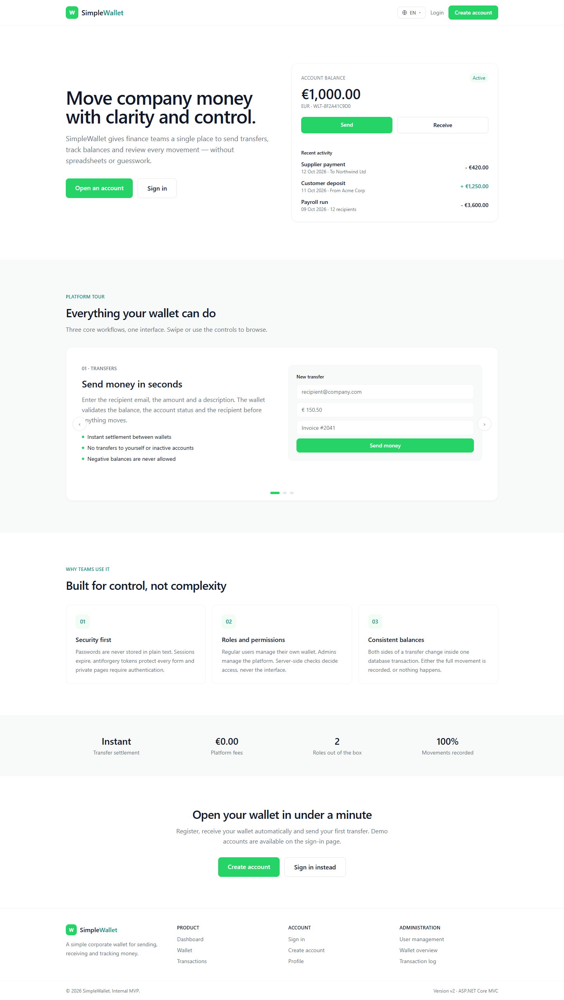 | 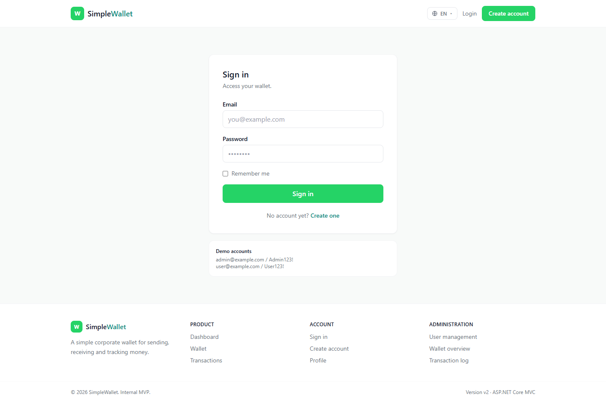 |

| Register | Swagger |
|---|---|
| 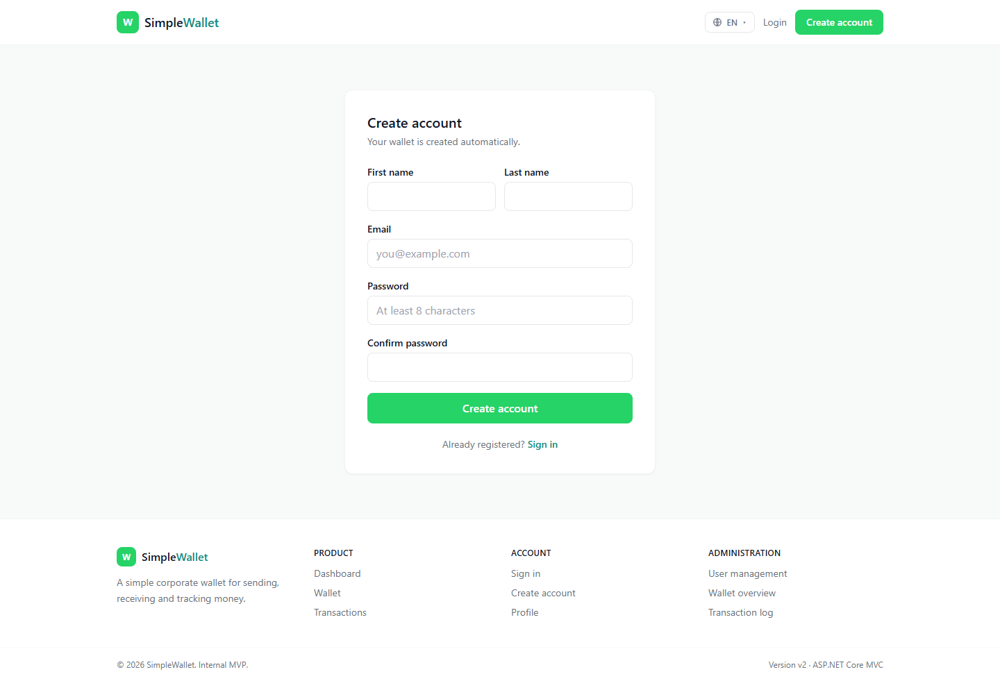 | 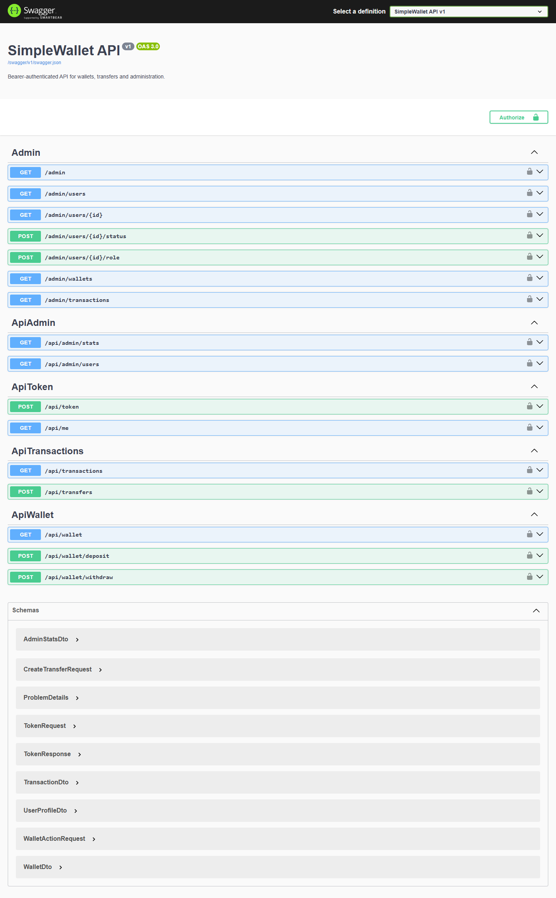 |

### User

| Dashboard | Wallet |
|---|---|
| 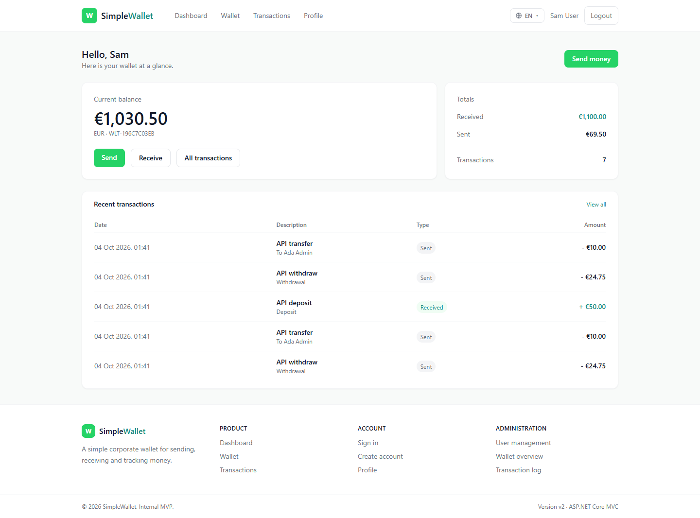 | 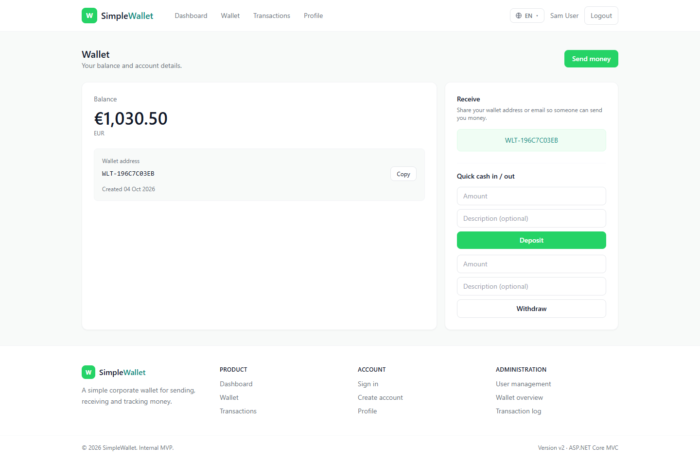 |

| Send money | Transactions |
|---|---|
| 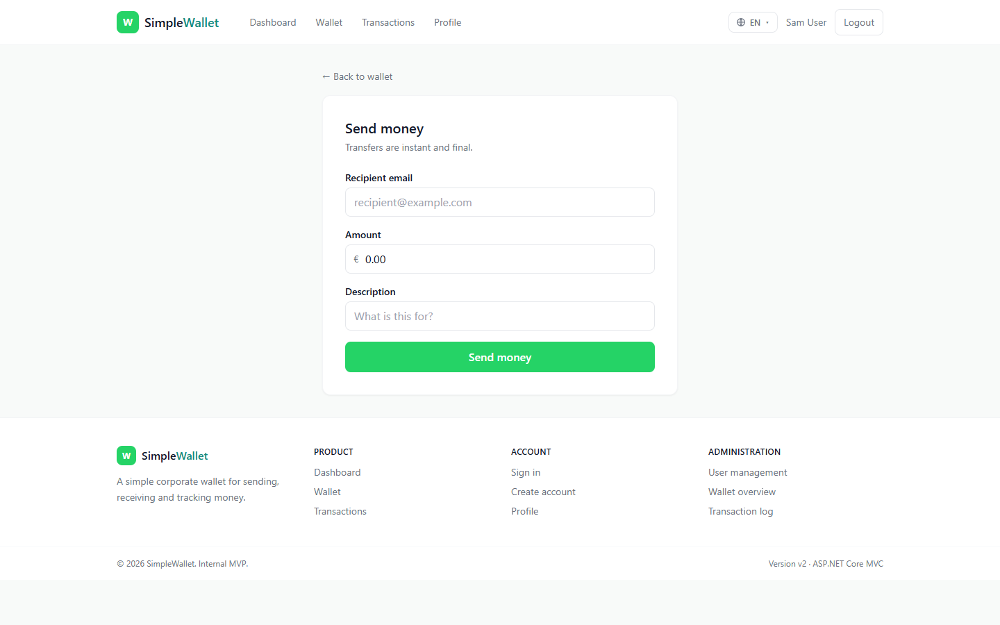 | 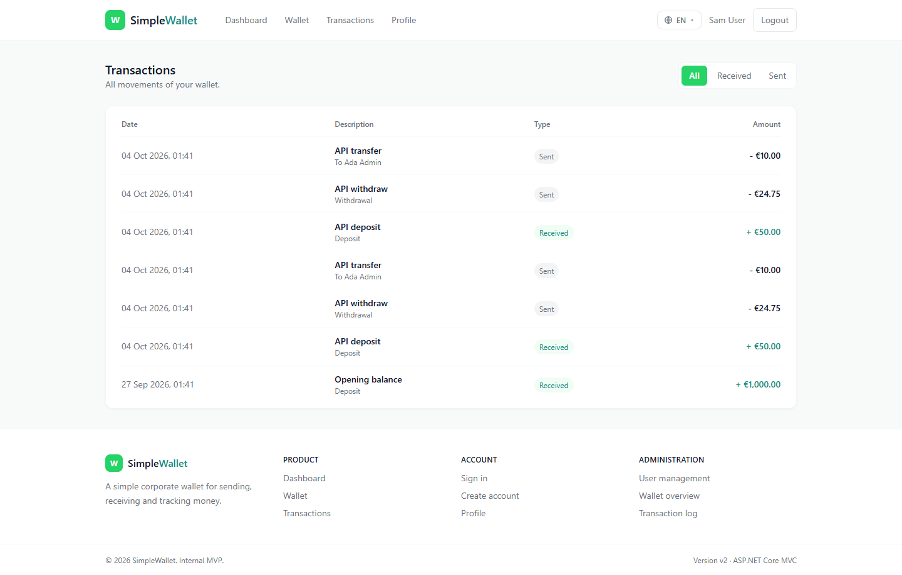 |

| Profile |
|---|
| 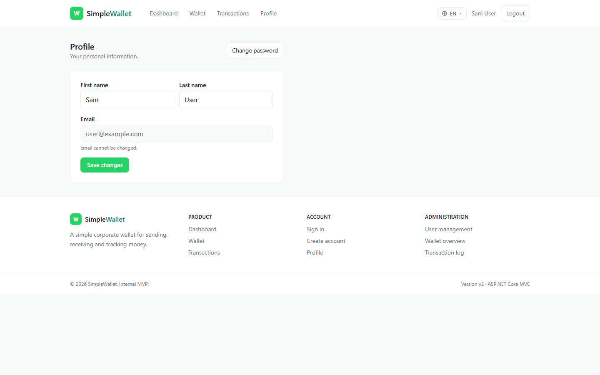 |

### Admin

The admin panel uses its own layout: dark sidebar, compact top bar with an
`ADMIN` badge, no marketing navigation and no footer.

| Overview | Users |
|---|---|
| 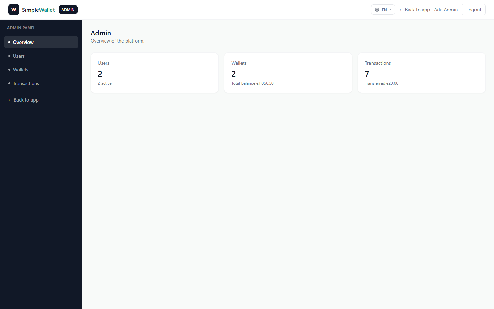 | 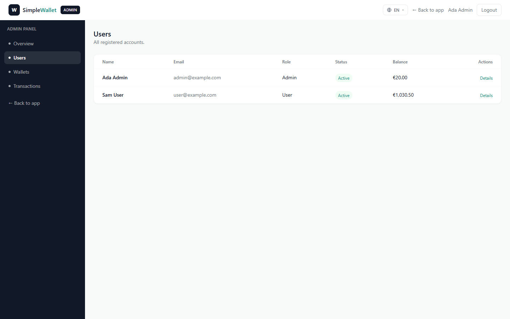 |

| User details | Wallets |
|---|---|
| 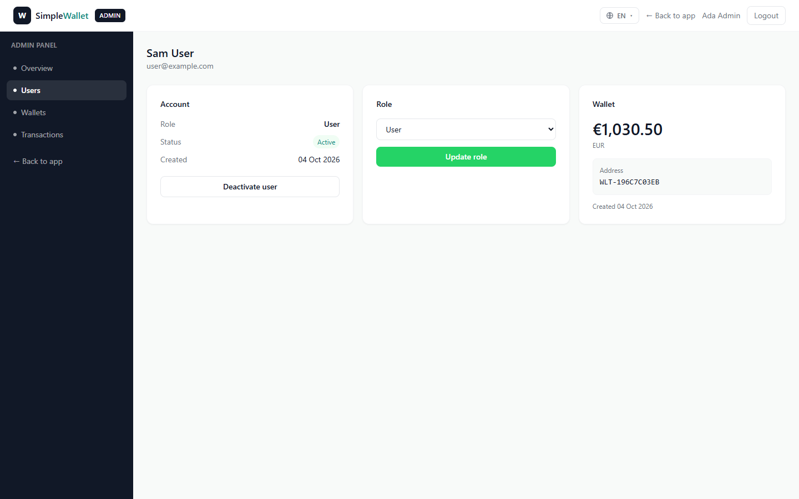 | 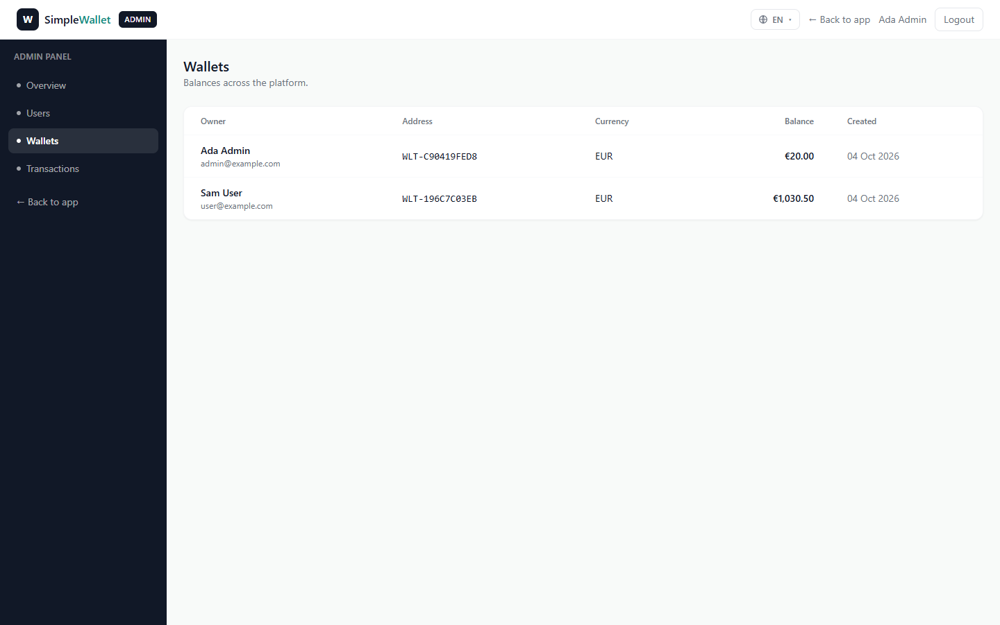 |

| Transactions |
|---|
| 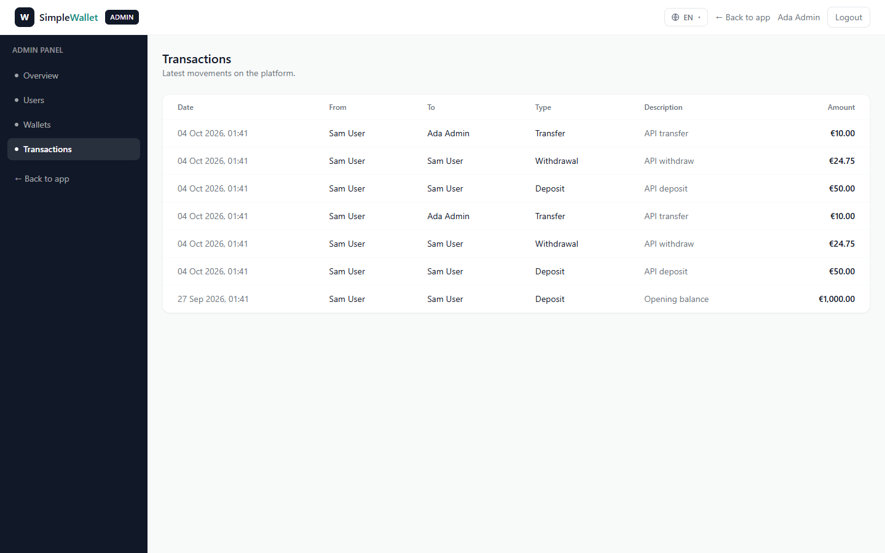 |

Screenshots live in `docs/screenshots/`.

## Stack

- ASP.NET Core MVC
- C#
- Entity Framework Core
- SQLite
- Tailwind CSS CDN
- Swashbuckle (Swagger / OpenAPI)
- Docker

## Features

- User registration
- Authentication (cookie)
- Wallet
- Balance
- Transfers
- Transactions
- Profile
- Admin panel with its own layout (dark sidebar)
- Roles and permissions
- Multi-language UI: English, Spanish, Italian
- REST API with bearer authentication
- Swagger / OpenAPI documentation

## Run

```bash
docker compose up -d
```

Application:

http://localhost:8080

Swagger (API documentation):

http://localhost:8080/swagger

Stop with:

```bash
docker compose down
```

The SQLite database and the data-protection keys survive container
recreation through the `wallet_data` volume, so users stay signed in.

## Demo

Admin:

```
admin@example.com
Admin123!
```

User:

```
user@example.com
User123!
```

## Language

The language switcher lives in the top navigation (EN / ES / IT) on every
layout, including the admin panel. It writes a culture cookie
(`AspNetCore.Culture`) and the request localization middleware picks it
up on the next request.

Supported cultures: `en-US`, `es-ES`, `it-IT`.

Strings are stored in `Localization/Texts.cs`, keyed by the English
text. Any string without a translation simply falls back to English.
Money always uses `.` for decimals and `,` for groups in every
language, so balances never break.

## Admin

- The admin panel has its **own layout** (`Views/Admin/_AdminLayout.cshtml`):
  dark sidebar navigation, compact top bar with the `ADMIN` badge,
  language switcher, logout, and no public footer.
- Signing in with an **admin account goes straight to `/admin`**.
  Regular users land on `/dashboard`.
- Admin routes are protected server-side with `[Authorize(Roles = "Admin")]`.

## API

All endpoints are JSON and live under `/api`.

Interactive documentation: **http://localhost:8080/swagger**
(OpenAPI spec: `/swagger/v1/swagger.json`).

| Method | Route                  | Auth    | Description |
|--------|------------------------|---------|-------------|
| POST   | `/api/token`           | none    | Exchange email + password for a bearer token |
| GET    | `/api/me`              | bearer  | Profile and wallet of the current user |
| GET    | `/api/wallet`          | bearer  | Balance, currency and address |
| POST   | `/api/wallet/deposit`  | bearer  | Add money to the wallet |
| POST   | `/api/wallet/withdraw` | bearer  | Remove money from the wallet |
| GET    | `/api/transactions`    | bearer  | History, `?filter=all\|received\|sent` |
| POST   | `/api/transfers`       | bearer  | Send money to another user |
| GET    | `/api/admin/stats`     | admin   | Platform statistics |
| GET    | `/api/admin/users`     | admin   | All users with wallets |

### Get a token

```http
POST /api/token
Content-Type: application/json

{ "email": "user@example.com", "password": "User123!" }
```

Response:

```json
{
  "token": "...",
  "tokenType": "Bearer",
  "expiresAt": "2026-10-05T12:00:00Z"
}
```

### Use the token

```http
GET /api/wallet
Authorization: Bearer <token>
```

### Send money

```http
POST /api/transfers
Authorization: Bearer <token>
Content-Type: application/json

{
  "recipientEmail": "admin@example.com",
  "amount": 10,
  "description": "Lunch"
}
```

### Errors

- `401` missing, invalid or expired token
- `403` valid token without the required role
- `400` validation or business errors, e.g.
  `{ "error": "Insufficient balance." }`

Tokens are stateless: they are protected with ASP.NET Core Data
Protection, carry the user id and the expiry, and live 24 hours by
default (`Api:TokenLifetimeHours` in `appsettings.json`). API error
messages are always English. Cookies from the web UI are rejected by
the API.

## Architecture

MVC + Services

```text
Controller
    ↓
Service
    ↓
DbContext
    ↓
SQLite
```

API follows the same path:

```text
ApiController → Service → DbContext → SQLite
```

See `AGENTS.md` for development and coding guidelines.
